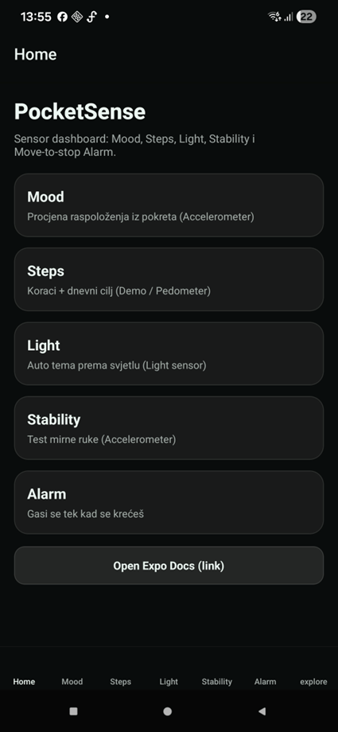

# PocketSense

<p align="center">
  
</p>

PocketSense is a mobile application built with Expo and React Native that demonstrates the use of device sensors, user interaction, and basic performance monitoring.

The application provides insight into user activity, movement, stability, ambient light conditions, and includes a motion-based alarm system.

---

## Technologies

* Expo
* React Native
* Expo Router
* expo-sensors (Accelerometer, Pedometer, Light sensor)
* Android (physical device testing)

---

## Installation and Running

### Install dependencies

```bash
npm install
```

### Start development server

```bash
npx expo start
```

### Android (required for pedometer)

```bash
npx expo run:android
```

---

## Sensors

### Accelerometer

Used for:

* Mood estimation based on movement intensity
* Stability testing
* Motion-based alarm control

Sensor data is processed in real time and reflected in the UI.

---

### Pedometer

Tracks the number of steps during the day.

Displays:

* Current step count
* Daily goal
* Progress indicator

Requires:

* Physical Android device
* Activity recognition permission

---

### Light Sensor

Measures ambient light (lux).

Features:

* Displays current light level
* Suggests light/dark mode
* Supports automatic and manual switching

---

## User Interaction

The application supports multiple interaction types:

* Tap (buttons and controls)
* Swipe (mood history navigation)
* Shake (reset stability test)
* Toggle switches (light mode control)

---

## Performance Monitoring

The app includes a dedicated profiling screen that monitors performance in real time.

Tracked metrics:

* JS FPS (approximation using requestAnimationFrame)
* Event loop lag (timer drift using setInterval)
* AppState (active, background, inactive)
* Re-render count

The screen also shows recent samples and provides a simple performance rating (Smooth / OK / Laggy).

---

## Features

* Mood detection based on movement
* Step tracking with progress
* Ambient light monitoring
* Stability testing
* Motion-based alarm
* Real-time performance tracking

---

## Notes

* Some sensors do not work properly in emulators
* Pedometer requires a development build and physical device
* Permissions must be granted for full functionality

---

## Author

Karlo Lauš
